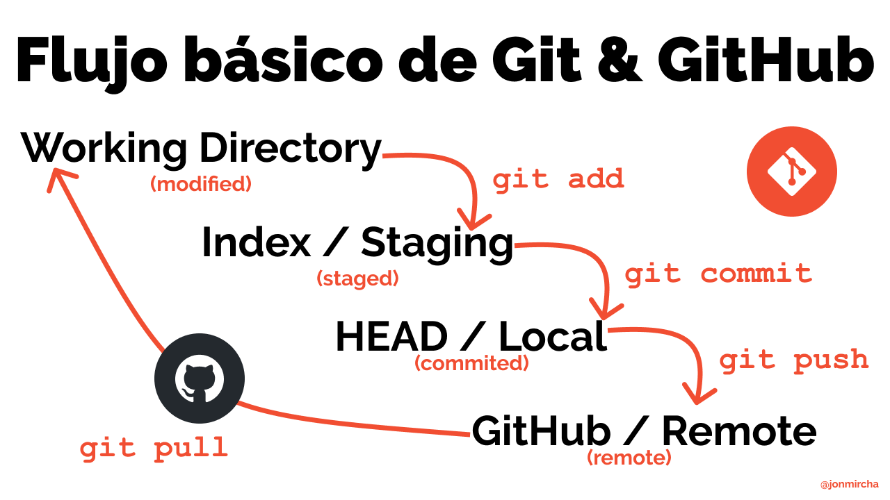
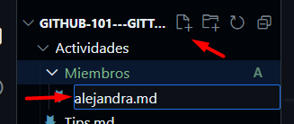
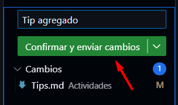
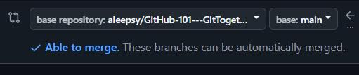

# GitHub 101 - GitTogether CDMX
Curso exprés para aprender Git y GitHub para la comunidad de GitTogether CDMX

## ¡Hola comunidad!

En **GitHub GitTogether CDMX**, estamos muy felices de darles la bienvenida y compartir con ustedes recursos que les serán útiles en el desarrollo y crecimiento en su carrera profesional y personal. Por ello, presentamos este curso para aprender los fundamentos de Git y GitHub como herramientas clave para desarrolladores dentro de la industria de tecnología.

Exploraremos los conceptos básicos de GitHub, incluyendo cómo configurar tu cuenta, crear y clonar repositorios, realizar y enviar cambios, colaborar con otros desarrolladores y más. Estaremos actualizando constantemente este contenido para ustedes y les compartiremos consejos y buenas prácticas para garantizar una gestión eficiente de tus flujos de trabajo.

GitHub es la plataforma líder que te permite mejorar tu productividad, facilitar la colaboración en los equipos y llevar el desarrollo de software al siguiente nivel.

¡Gracias por acompañarnos!

***- Equipo GitHub GitTogether CDMX***

---

## Introducción
GitHub es una plataforma basada en la nube donde puedes almacenar, compartir y colaborar junto con otros usuarios. Aloja un sistema de control de versiones [(VCS)](https://docs.github.com/es/get-started/start-your-journey/about-github-and-git#about-git) llamado Git y en conjunto te permiten llevar el seguimiento y administrar los cambios de tu proyecto. Muchas de las acciones que realizas en Git mediante la consola, puedes realizarlas directamente desde tu navegador gracias a GitHub.

Conoce más [aquí](https://docs.github.com/es/get-started/start-your-journey/about-github-and-git#c%C3%B3mo-funcionan-git-y-github-juntos) y mira el siguiente [▶️video](https://youtu.be/pBy1zgt0XPc?si=3xC7IMYKmClIKUcB).

<!-- 
  <<< Conceptos básicos >>> 
-->

<h2>Conceptos básicos</h2>

Existe una serie de conceptos que utilizaras a partir de ahora que trabajes tus proyectos en estas plataformas, por ejemplo:

### Repositorios

Un repositorio o "repo" es un proyecto que contiene múltiples archivos con los que administrarás el mismo, por ejemplo, aquellos basados en código, carpetas, imágenes, etc.

### Ramas

Definamos las ramas como une versión creada en paralelo  y de forma aislada de tu proyecto base. Cuando se crea una rama, se copian todos los archivos y el historial de cambios del repositorio principal, y a partir de ahí se pueden realizar modificaciones sin afectar a la rama principal (también conocida como rama `master` o `main`).

Crear ramas te permite solucionar errores, desarrollar nuevas características o hacer pruebas en tu proyecto y que cada colaborador pueda trabajar en sus propias contribuciones.

### Commits

Los commits con el conjunto de cambios dentro de los archivos del proyecto.

### Pull Requests

Las Pull Request (PR) son peticiones para integrar nuestras propuestas o cambios de código a un proyecto.
Esto permite que aquelllos usuarios que no sean los propietarios, contribuyan al mismo y mediante las PR, el propietario decida integrar esas contribuciones, solicitar modificaciones e incluso rechazarlas. 

### Issues
Dentro de la administración de un proyecto, el sistema de issues o incidencias en GitHub es una forma de realizar un seguimiento y administrar el trabajo necesario para mejorarlos. Cada issue puede significar una tarea, un informe de errores o una solicitud de función y se puede asignar a los miembros del equipo, etiquetar con etiquetas y vincular a hitos.

### Merge

La fusión, o merge, se refiere al proceso de combinar los cambios de una rama a otra, generalmente a la principal. GitHub utiliza un algoritmo de fusión llamado "merge commit" para combinar las diferencias entre las dos ramas. Este "merge commit" registra el historial de cambios y permite mantener un registro de los cambios realizados en cada rama.

### Projects

GitHub Projects es una herramienta integrada en la plataforma GitHub que te permite crear tableros de proyectos para organizar y dar seguimiento a tu trabajo. Es una gran funcionalidad que te ayudará en la gestión de tus proyectos y colaborar con tus equipos de trabajo.

> [!TIP]
> Te compartimos un [▶️video](https://youtu.be/r8jQ9hVA2qs?si=IRzStEVNR_UrMVpZ) para entender mejor estos conceptos.

<!-- 
  <<< Comandos Git >>> 
-->

<h2>Comandos básicos de Git</h2>

**Configurar un usuario**

Puedes configurar el nombre del autor y la dirección de correo electrónico para registrar de quien provienen los cambios.

`git config --global user.name "Nombre Usuario"`

`git config --global user.email nombreusuario@gmail.com`

**Crear un repositorio local**

Cuando quieres crear un repositorio local primero debes inicializarlo con el siguiente comando:

`git init`

**Clonar un repositorio**

Para crear o clonar una copia de otro repositorio local utilizamos:

`git clone /ruta/del/repositorio`

**Agregar archivos**

Si queremos agregar archivos al stage o index (para luego hacer commit) lo hacemos con el comando add:

`git add <nombre_archivo>`

`git add .`

**Crear un commit**

Confirmamos nuestros cambios en head (pero aún no en el repositorio remoto):

`git commit -m "Mensaje del commit"`

**Subir commit a un repositorio remoto**

Para enviar los cambios a la rama **main** de un repositorio remoto:

`git push origin main`

**Estado de los archivos**

Para listar y enumerar los archivos que han sufrido cambios y los que aun no han sido agregados o confirmados mediante commit:

`git status`

**Manipulación de ramas**

Para crear y modificar una nueva rama:

`git checkout -b <nombre_nueva_rama>`

Cambiar de una rama a otra:

`git checkout <nombre_rama>`

Enumerar todas las ramas en tu repositorio y también saber en que rama o _branch_ nos encontramos:

`git branch`

Eliminar una rama personalizada:

`git branch -d <nombre_rama>`

Subir una rama a un repositorio remoto, para que otros puedan usarla:

`git push origin <nombre_rama>`

Sube todas las ramas a tu repositorio remoto:

`git push --all origin`

Eliminar una rama en tu repositorio remoto:

`git push origin <nombre_rama>`

_En construcción..._

### Flujo básico de Git y GitHub

<!-- 
  <<< Práctica >>> 
-->

> [!TIP]
> Para abrir enlaces te recomendamos presionar la tecla **[CTRL]** y, sin soltar, dar clic en el enlace. Esto abrirá los enlaces en una nueva pestaña en tu navegador.

<h2>¡Practiquemos!</h2>

1. Haz clic en el boton de arriba para hacer **Fork** de este repositorio. En la nueva página coloca el nombre que más te guste.
2. Espera alrededor de 20 segundos para ver tu nuevo repositorio.
3. Cuando hayas creado el fork, puedes editarlo de la siguiente manera:
   - a) **Clonar** el repositorio:
     1. Selecciona una carpeta en tu computadora y ejecuta este comando: `git clone url_de_tu_repo`
     2. Entra a la carpeta creada con el mismo nombre de tu repositorio.
   - b) Usar **github.dev**:
     1. En la raíz de tu repositorio, presiona la tecla:  `.`.

¡Sencillo! ¿Verdad?

<!-- 
  <<< Actividad 0 >>> 
-->

> [!NOTE]
> De preferencia, utiliza dos ventanas del navegador para seguir las instrucciones y poder trabajar en el repositorio que creaste.

<h2>Actividad 0</h2>

:octocat: Ahora que tienes una copia del repositorio original, vamos a comenzar con el manejo de archivos. 

Practiquemos lo siguiente:

1. Dirígete a la carpeta [Miembros](./Actividades/Miembros) dentro de la carpeta **Actividades**.
2. Presiona la tecla `.` para abrir tu editor en línea.
3. Dentro de la carpeta vas a crear un archivo de Markdown que lleve tu nombre y la extensión **.md**, por ejemplo:

4. Dentro de este nuevo archivo, agregarás tu nombre y apellido y tu handle de github (o username). Además una breve descripción de ti, sigue el [formato de ejemplo](./Actividades/Miembros/alejandra.md).

5. Recuerda trabajar sobre el archivo con tu nombre y no sobreescribir el de ejemplo.

6. Una vez agregada tu bio, te vas a dirigir al [Octodex](https://octodex.github.com/) y elegirás al octocat que más te guste, esta imagen la agregaras justo debajo del texto. Puedes simplemente copiar y pegar la imagen en tu archivo **.md** o bajarla en tu computadora, arrastrar y soltar en el editor.

### ¡Sencillo!

Ahora sabes como crear y editar archivos.

<!-- 
  <<< Actividad 1 >>> 
-->

<h2>Actividad 1</h2>

:octocat: A continuación, veremos como colaborar en este repositorio:

1. Dirígete al archivo [Tips.md](./Actividades/Tips.md) dentro de la carpeta **Actividades**.
2. Recuerda utilizar **github.dev** para abrir tu editor en línea.
3. En el archivo de [Tips.md](./Actividades/Tips.md), copia el tip de ejemplo y pegalo justo debajo. Vas a agregar un Tip que les darías a las demas personas para mejorar en programación.

4. Haz clic en el ícono de control de código fuente dentro de tu editor.

5. Escribe un nombre y envía los cambios.

6. Dirígete a tu repositorio y verás la siguiente opción:

6. Abre un Pull Request **(PR)** y coloca en el titulo `He agregado mi tip - Tu Nombre`y opcionalmente una descripción.

7. Asegúrate de no tener conflictos.

8. Crea tu **PR**.

### ¡Felicidades!

Creaste tu primera contribución a un repositorio en GitHub.

<!-- 
  <<< Actividad 2 >>> 
-->

<h2>Actividad 2</h2>

## Contribuidores
[Alejandra Pérez](https://github.com/aleepsy)

[Manuel Ortiz](https://github.com/manuosmx)