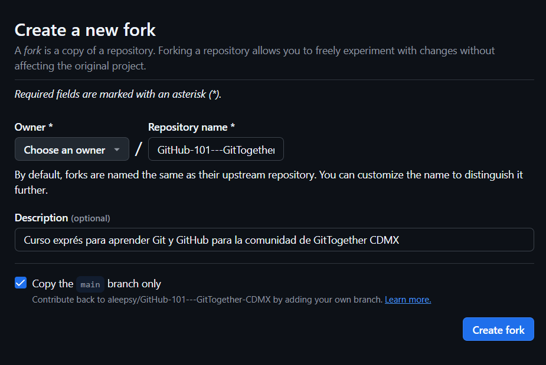

# GitHub 101 - GitTogether CDMX
Curso exprés para aprender Git y GitHub para la comunidad de GitTogether CDMX

## ¡Hola comunidad!

En **GitHub GitTogether CDMX**, estamos muy felices de darles la bienvenida y compartir con ustedes recursos que les serán útiles en el desarrollo y crecimiento en su carrera profesional y personal. Por ello, presentamos este curso para aprender los fundamentos de Git y GitHub como herramientas clave para desarrolladores dentro de la industria de tecnología.

Exploraremos los conceptos básicos de GitHub, incluyendo cómo configurar tu cuenta, crear y clonar repositorios, realizar y enviar cambios, colaborar con otros desarrolladores y más. Estaremos actualizando constantemente este contenido para ustedes y les compartiremos consejos y buenas prácticas para garantizar una gestión eficiente de tus flujos de trabajo.

GitHub es la plataforma líder que te permite mejorar tu productividad, facilitar la colaboración en los equipos y llevar el desarrollo de software al siguiente nivel.

¡Gracias por acompañarnos!

**-Equipo GitHub GitTogether CDMX**

---

## Introducción
GitHub es una plataforma basada en la nube donde puedes almacenar, compartir y colaborar junto con otros usuarios. Aloja un sistema de control de versiones [(VCS)](https://docs.github.com/es/get-started/start-your-journey/about-github-and-git#about-git) llamado Git y en conjunto te permiten llevar el seguimiento y administrar los cambios de tu proyecto. Muchas de las acciones que realizas en Git mediante la consola, puedes realizarlas directamente desde tu navegador gracias a GitHub.

Conoce más [aquí](https://docs.github.com/es/get-started/start-your-journey/about-github-and-git#c%C3%B3mo-funcionan-git-y-github-juntos) y mira el siguiente [▶️video](https://youtu.be/pBy1zgt0XPc?si=3xC7IMYKmClIKUcB).

### Flujo básico de Git y GitHub

<!-- 
  <<< Conceptos básicos >>> 
-->

<h2>Conceptos básicos</h2>

Existe una serie de conceptos que utilizaras a partir de ahora que trabajes tus proyectos en estas plataformas, por ejemplo:

### Repositorios

Un repositorio o "repo" es un proyecto que contiene múltiples archivos con los que administrarás el mismo, por ejemplo, aquellos basados en código, carpetas, imágenes, etc.

### Ramas

Definamos las ramas como une versión creada en paralelo  y de forma aislada de tu proyecto base. Cuando se crea una rama, se copian todos los archivos y el historial de cambios del repositorio principal, y a partir de ahí se pueden realizar modificaciones sin afectar a la rama principal (también conocida como rama `master` o `main`).

Crear ramas te permite solucionar errores, desarrollar nuevas características o hacer pruebas en tu proyecto y que cada colaborador pueda trabajar en sus propias contribuciones.

### Commits

Los commits con el conjunto de cambios dentro de los archnivos del proyecto.

### Pull Requests

Las Pull Request (PR) son peticiones para integrar nuestras propuestas o cambios de código a un proyecto.
Esto permite que aquelllos usuarios que no sean los propietarios, contribuyan al mismo y mediante las PR, el propietario decida integrar esas contribuciones, solicitar modificaciones e incluso rechazarlas. 

### Issues
Dentro de la administración de un proyecto, el sistema de issues o incidencias en GitHub es una forma de realizar un seguimiento y administrar el trabajo necesario para mejorarlos. Cada issue puede significar una tarea, un informe de errores o una solicitud de función y se puede asignar a los miembros del equipo, etiquetar con etiquetas y vincular a hitos.

### Merge

La fusión, o merge, se refiere al proceso de combinar los cambios de una rama a otra, generalmente a la principal. GitHub utiliza un algoritmo de fusión llamado "merge commit" para combinar las diferencias entre las dos ramas. Este "merge commit" registra el historial de cambios y permite mantener un registro de los cambios realizados en cada rama.

### Projects

GitHub Projects es una herramienta integrada en la plataforma GitHub que te permite crear tableros de proyectos para organizar y dar seguimiento a tu trabajo. Es una gran funcionalidad que te ayudará en la gestión de tus proyectos y colaborar con tus equipos de trabajo.

> [!TIP]
> Te compartimos un [▶️video](https://youtu.be/r8jQ9hVA2qs?si=IRzStEVNR_UrMVpZ) para entender mejor estos conceptos.

<!-- 
  <<< Práctica >>> 
-->

<h2>¡Practiquemos!</h2>

> [!TIP]
> Para abrir enlaces te recomendamos presionar la tecla **[CTRL]** y, sin soltar, dar clic en el enlace. Esto abrirá los enlaces en una nueva pestaña en tu navegador.

1. Haz clic en el boton de arriba para hacer **Fork** de este repositorio. En la nueva página coloca el nombre que gustes al repositorio.
2. Espera alrededor de 20 segundos para ver tu nuevo repositorio.
3. Cuando hayas creado el fork, puedes editarlo de la siguiente manera:
   - a) **Clonar** el repositorio:
     1. Selecciona una carpeta en tu computadora y ejecuta este comando: `git clone url_de_tu_repo`
     2. Entra a la carpeta creada con el mismo nombre de tu repositorio.
   - b) Usar **github.dev**:
     1. En la raíz de tu repositorio, presiona la tecla:  `.`.

¡Sencillo! ¿Verdad?

<!-- 
  <<< Actividad 1 >>> 
-->

<h2>Actividad 1</h2>

Ahora que tienes una copia del proyecto original, practiquemos lo siguiente:

1. Dirígete al archivo [Tips.md](./Actividades/Tips.md) dentro de la carpeta **Actividades**.
2. En el archivo de [Tips.md](./Actividades/Tips.md), copia el tip de ejemplo y pegalo justo debajo. Vas a agregar un Tip que les darías a las demas personas para mejorar en programación.
3. Crea un Pull Request **(PR)** y coloca en el titulo `He agregado mi tip - Tu Nombre`
4. Manda tu **PR**.

